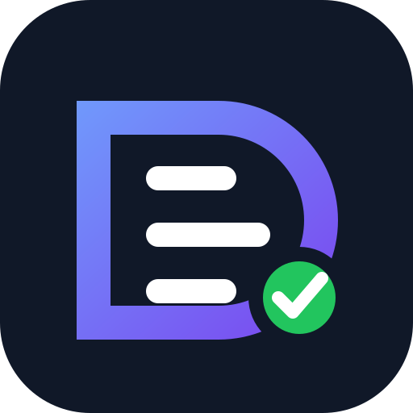
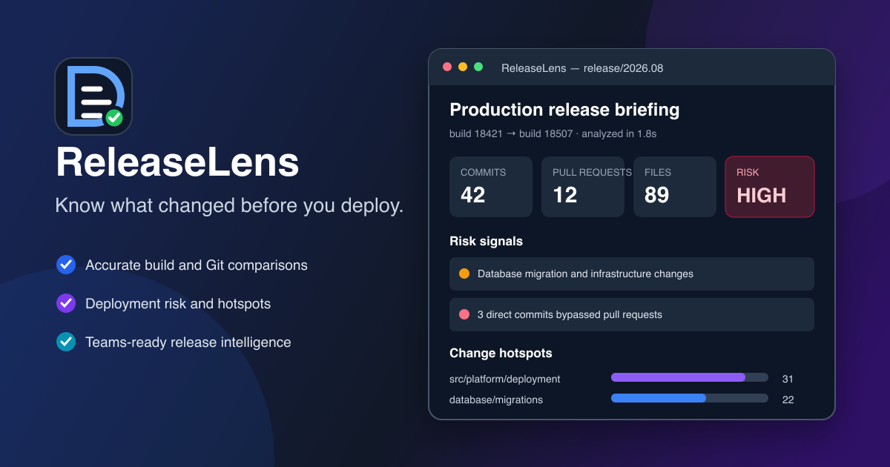

<p align="center">
  
</p>

<h1 align="center">ReleaseLens for Azure DevOps</h1>

<p align="center">
  Know what changed. Understand deployment risk. Publish release intelligence.
</p>

<p align="center">
  <a href="https://marketplace.visualstudio.com/items?itemName=matancohenmsft.fe-ninja-tools">Install from VS Code Marketplace</a>
  ·
  <a href="https://github.com/matanelcohen/vscode-ado-build-compare/issues/new?template=feedback.yml">Send feedback</a>
  ·
  <a href="PRIVACY.md">Privacy</a>
</p>

<p align="center">
  <a href="https://marketplace.visualstudio.com/items?itemName=matancohenmsft.fe-ninja-tools"></a>
  <a href="https://marketplace.visualstudio.com/items?itemName=matancohenmsft.fe-ninja-tools"></a>
  <a href="https://marketplace.visualstudio.com/items?itemName=matancohenmsft.fe-ninja-tools&ssr=false#review-details"></a>
  <a href="https://github.com/matanelcohen/vscode-ado-build-compare/actions/workflows/ci.yml"></a>
</p>

<p align="center">
  
</p>

ReleaseLens turns Azure DevOps pipeline history into a release briefing inside
VS Code. Compare any two builds, branches, tags, or environments and get the
pull requests, direct commits, contributors, changed files, hotspots, and
deployment risk in one place.

## Reach value in 30 seconds

1. Install ReleaseLens.
2. Open the ReleaseLens icon in the Activity Bar.
3. Select **Explore sample release**—no account or setup required.
4. When ready, select **Connect Azure DevOps** and follow guided discovery.

ReleaseLens uses VS Code's Microsoft sign-in. No Azure DevOps PAT is requested
or stored.

## Why teams use ReleaseLens

- **Accurate comparisons** based on Git ancestry, not timestamps.
- **Release risk** for infrastructure, database, security, configuration,
  dependency, volume, and direct-commit signals.
- **Fast investigation** with hotspots, search, PR/direct-commit filters, and
  incremental rendering for large releases.
- **Environment drift** across compatible pipeline profiles.
- **Copilot summaries** generated only when explicitly requested.
- **Teams Adaptive Cards** with release metrics and optional user mentions.
- **Portable output** through Markdown, JSON, clipboard, and Azure DevOps work
  items.
- **Release history** to reopen recent comparisons.
- **Secure defaults**: Microsoft tokens remain in the extension host and Teams
  Workflow URLs use VS Code SecretStorage.

## Guided setup

The onboarding flow discovers:

1. Azure DevOps organization
2. Project
3. Repository
4. Pipeline
5. Deployment stage
6. Optional relevant paths

Save multiple profiles for services and environments, then switch between them
from the native Release Dashboard. Existing `buildCompareTools.*` settings are
imported once for backward compatibility.

## Sharing with Microsoft Teams

Create a Teams Workflow using **When a Teams webhook request is received**, then
run **ReleaseLens: Configure Teams Workflow**. Workflow URLs are stored in
SecretStorage and never sent to the webview.

Automatic Teams checks are opt-in and run only while VS Code is active. Assign
workflow co-owners so notifications do not depend on one account.

## Permissions and privacy

ReleaseLens requests Azure DevOps code/build access through VS Code's Microsoft
authentication provider. It does not operate a backend service, sell data, or
collect product telemetry. Comparison history and profiles remain in VS Code
storage. See [PRIVACY.md](PRIVACY.md) and [SECURITY.md](SECURITY.md).

## Requirements

- VS Code 1.91 or later
- Azure DevOps Services organization accessible to the signed-in account
- Optional: Teams Workflow webhook
- Optional: a VS Code language model for Copilot summaries

## Support

- [Report a bug](https://github.com/matanelcohen/vscode-ado-build-compare/issues/new?template=bug_report.yml)
- [Share feedback](https://github.com/matanelcohen/vscode-ado-build-compare/issues/new?template=feedback.yml)
- [View releases](https://github.com/matanelcohen/vscode-ado-build-compare/releases)

## Development

```bash
npm ci
npm run check
npm run package
```

The deterministic test suite does not contact external services. Live
Azure DevOps and Teams smoke tests are explicitly opt-in through
`npm run test:live`.

Licensed under the [MIT License](LICENSE).
