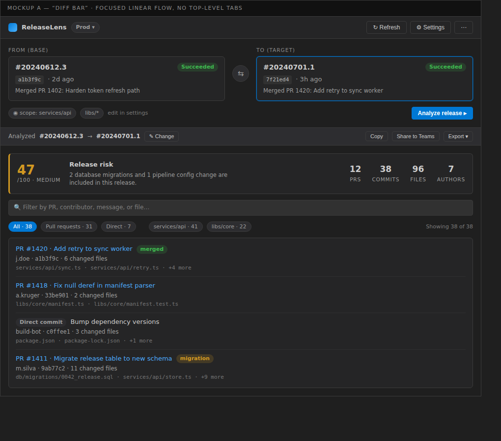
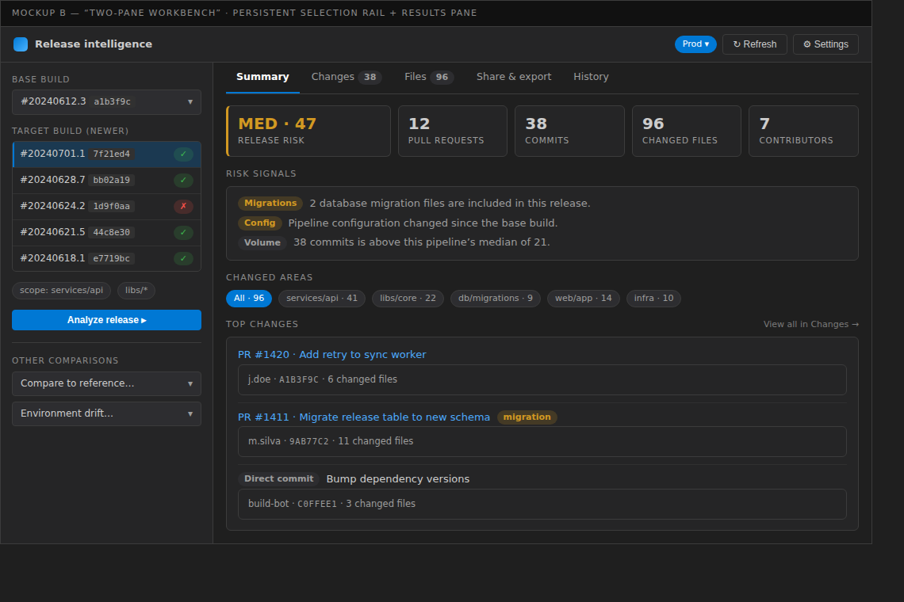
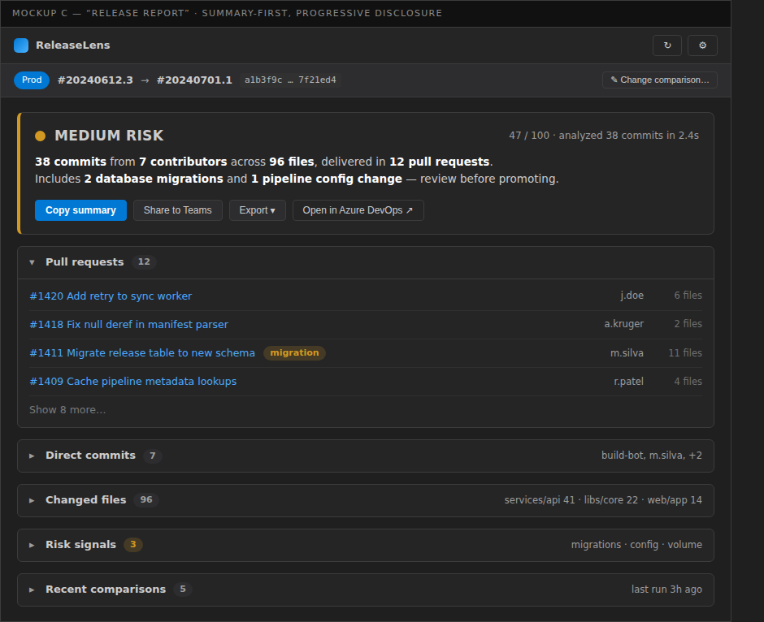

# Webview redesign mockups

Static, non-functional mockups of three redesign directions for the comparison webview
(`src/pages/ComparisonPage.tsx`). Pick one and it will be implemented.

Each option is a plain HTML file styled to approximate the VS Code dark theme. Open any
`.html` file in a browser to view it live; the `.png` files are rendered screenshots.

| Option | Name | Idea | Best for |
| --- | --- | --- | --- |
| [A](mockup-a.png) | Diff Bar | A single linear surface: from/to build cards with a swap control, then results below. Top-level tabs removed; selection collapses to a breadcrumb after analysis. | Narrow side panels, fastest path to an answer |
| [B](mockup-b.png) | Two-Pane Workbench | Persistent left rail for base/target selection plus a tabbed results pane (Summary / Changes / Files / Share / History). Collapses to a single column on narrow widths. | Editor-tab usage, most information on screen |
| [C](mockup-c.png) | Release Report | Summary-first verdict card answering "is it safe to ship?", with details behind accordions and share/export promoted to the top. | Release managers, screenshot-ability |

## Option A — Diff Bar

## Option B — Two-Pane Workbench

## Option C — Release Report

## Improvements common to all three

1. Consistent design tokens — Fluent `tokens` for spacing/radius/typography, `var(--vscode-*)` for color surfaces only.
2. Tighter density suited to a panel: smaller page padding, `Title3` instead of `Title1`, smaller metric numerals.
3. Base and target presented as one from → to unit instead of two stacked info cards; path scope shown as a quiet chip instead of a bold banner.
4. Real loading/empty/error states: skeletons, illustrated empty states, `MessageBar` for all errors.
5. Profile actions (Switch / Add / Edit / Delete) collapsed into one menu, with Delete de-emphasized and confirmed.
6. Accessible build list (`listbox` semantics, roving tabindex, arrow-key navigation) and verified contrast in both themes.
7. Virtualized commit list with a sticky filter toolbar, replacing the manual "Show 50 more" pager.
8. Persist base build, filters, and active tab via `vscode.setState`.
